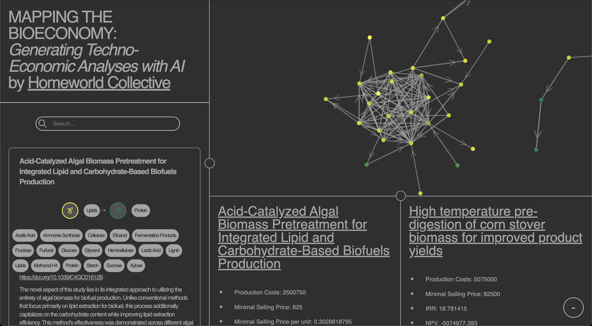

### AI-TEAs

# Automated Techno-Economic Analysis (TEA) using Manufacturing MarkUp Language (MaML)

##### [Homeworld Collective](https://homeworld.bio/) -- Kyle Barnes, Daniel Goodwin, Mark Hansen, Jesse Lou


**Problem:** Scientists are exceptional at solving challenges in their domain and demonstrating possibilities at the bench. Deployments to the field however come with many variables, often beyond the training and scope of what a scientist. 

**Concept:** Utilizing LLMs, we can find and parse existing technoeconomic analysis literature to help guide researchers in full technoeconomic analysis (TEA). To standardize how we talk about these industrial processees, we've proposed a standard *Manufacturing Markup Language (MaML)*.

## Approach: Exploring Corn to Ethanol Production

To explore this idea, we built our code to evaluate different processes and variables involved in the production of ethanol from corn and sugar cane, a well studied industrial process in the United States.

Our demo of an LLM-driven workflow has 4 distinct sections:
- Knowledge Management (ex: paper management, open-ended text input)
- Generating *Manufacturing Markup Language* (MaML) for a given query/exploration
- Executing TEA Simulations with varying parameters and fidelity (Lvl 1: LLM function writing <> Lvl 7: BioSTEAM)
- MaML & TEA Simulation Results Viewing

In this respository, you'll find distinct code directories for each section/role.

## Demo Setup & Run

Before running the repository's demo code, do the following:
- Install dependencies via `pip install -r requirements.txt`
- Sign up for an [OpenAI API key](https://platform.openai.com/)
- Create a `.env` file in the root of this repository, with the env variable and secret `OPENAI_API_KEY=abcdef`

To evaluate some sample paper text, generate related MaMLs, and simulate TEAs, run at the roof: `python demo.py`


## Explore: Generating MaMLs


**Overview**: Our MaML structure is quite simple: input feedstock, output target product, and processing flow steps each with their own inputs, outputs, and parameters describing the step and its work. These are iteratively constructed, by prompts first describing high level process decisions, before iteratively going through and evaluating inputs/outputs.

To guide the LLM, we provide in-context examples, a range of enums describing industrial processes, and Department of Energy tags so we can tie processes back to formal language/datasets used in federal agencies.

**Learnings**: After exploring hundreds of TEA papers we found publicly, we found that literature still was narrowly focused on specific steps in an inudstrial process. In reality, it takes a broader review than nearly all papers take.

LLMs can be valuable for filling in process gaps, but ensuring consistency in process step attributes be monitored and enforced. We did this by providing a dictionary of possible processing steps (ex: for pretreatment, `pretreatment.hot_water_pretreatment`, `pretreatment.dilute_acid_pretreatment`, etc.)


**Future Explorations**: After we built our code to handle paper analysis and the gaps we were seeing in literature, we realized we could allow an extensive description from a user and generate comparable if not better MaMLs for a user's use case because it can fully describe a real world scenario and stages which doesn't happen as often in literature.

We also think that the process of generating a MaML can be an interactive and cycling process than 1 shot, allowing for a richer processing details.

**Example MaML:** Here is an example generated process flow for one of the papers we analyzed.

```
{
  "paper_id": "https://doi.org/10.1016/j.cej.2022.138886",
  "title": "Rewiring yeast metabolism for producing 2,3-butanediol and two downstream applications: Techno-economic analysis and life cycle assessment of methyl ethyl ketone (MEK) and agricultural biostimulant production",
  "process_feedstock": "lignocellulosic_biomass",
  "process_flow": [
      {
          "type": "pretreatment.dilute_sulfuric_acid_hydrolysis",
          "description": "Pretreatment with dilute sulfuric acid hydrolysis is a crucial bio-industrial process step for the production of biofuels and biochemicals ... (trimming for README)",
          "parameters": [
              {
                  "name": "conversion_rate",
                  "unit": "%"
              }
          ],
          "output": {
              "name": "soluble_sugars",
              "unit": "tonne/day"
          }
      },
      {
          "type": "enzyme_production.cellulase_production",
          "description": "The bio-industrial process for enzyme production, particularly cellulase production, involves various microbial systems, including fungi and ... (trimming for README)",
          "parameters": [
              {
                  "name": "yield_per_fermentation_batch",
                  "unit": "g/L"
              }
          ],
          "output": {
              "name": "cellulase",
              "unit": "tonne/day"
          }
      },
      {
          "type": "saccharification.glucan_to_glucose_conversion",
          "description": "The process of saccharification involving the conversion of glucan to glucose is pivotal in the production of bio-based chemicals from lignocellulosic biomass.... (trimming for README)",
          "parameters": [
              {
                  "name": "conversion_rate",
                  "unit": "%"
              }
          ],
          "output": {
              "name": "glucose",
              "unit": "tonne/day"
          }
      },
      // ...
      // ... more processing steps here
      // ...
      {
          "type": "separation.methyl_ethyl_ketone_purification",
          "description": "The bio-industrial separation process for methyl ethyl ketone (MEK) purification following the production of 2,3-butanediol (2,3-BDO) by engineered yeast involves an... (trimming for README)",
          "parameters": [
              {
                  "name": "distillation_extraction_rate",
                  "unit": "%"
              }
          ],
          "output": {
              "name": "methyl_ethyl_ketone",
              "unit": "tonne/day"
          }
      }
  ],
  "process_target": "2_3_butanediol"
}
```

## Explore: Automating Techno-Economic Analysis


**Overview**: With a consistent structure and defintions, we can do a range of techno-economic analyses with different input parameters. In our demo, we actual generate a range of parameter values, simulating different scenarios of feedstock and energy prices. These TEA "simulations" are done in two ways.

The TEA "level 1s" are high level, where we utilize LLMs to write python code to return some ouptut target_product given an input and process step paramters alongside the processing context. At the end, we can generate a high level CSV outlining the process flow steps and their inputs/outputs.

The TEA "level 7s" utilize chemical engineering simulation packages, in our case BioSTEAM, for generating detailed processing simulations. Our stricter set of enums can guide our code to build a "simulation mesh" for running an extremely thorough analysis. At the end, we can generate a process flow mermaid chart.

**Learnings**: Economic evaluations require many factors beyond the products touched by an invention, like capex investments, energy costs, and wastewater treatment. Sometimes ideas can be written off with early back of the napkin math while others take an extensive look at unit economics given several commodity prices.

To tackle that variability, we setup the varying "levels" of TEA analysis, but deep technical analysis at chemical engineering levels still requires many assumptions.

**Future Explorations**: Bringing together generative tooling and chemical engineering packages, can open up a new way to explore and industrial processing flows. We see a future where an iterative process with the researcher in the loop can both enrich TEA analysis and help guide users to new ideas.

**Simulation Results & History:** Here is an example of LLM driven python function writing using the MaML processing flow and descriptions with input parameters from the user. In this first version we ballpark step outputs, but we experimented with product output and cost as an expected tuple output of each function.

```
{
    "level": 1,
    "result": {
        "production_costs": 1120000,
        "minimal_selling_price": null, // WIP
        "minimal_selling_price_per_unit": null, // WIP
        "target_selling_price_per_unit": 180,
        "irr": null, // WIP
        "npv": null // WIP
    },
    "input_maml": {
        // ... MaML JSON described above as snapshot
    },
    "input_params": {
        "prices": {
            "lignocellulosic_biomass": 50
        },
        "target_product_price": 180,
        "input_product_price": 60,
        "input_product_amount": 2000,
        "cap_ex": 1000000,
        "conversion_rate": 0.9,
        "yield_per_fermentation_batch": 1500,
        "solvent_recovery_efficiency": 95,
        "distillation_efficiency": 80,
        "conversion_efficiency": 85,
        "distillation_extraction_rate": 75
    },
    "exec_history": [
        {
            "fn_name": "process_function_output_num_soluble_sugars",
            "fn_str": "\ndef process_function_output_num_soluble_sugars(input_product_amount: float, conversion_rate: float) -> float:\n    '''\n    Calculate the output of soluble sugars from the feedstock processing based on the input biomass amount and conversion efficiency.\n    \n    :param input_product_amount: Amount of biomass input to the process (tonne/day).\n    :param conversion_rate: Conversion rate of biomass to soluble sugars (%).\n    :return: The amount of soluble sugars produced (tonne/day).\n    '''\n    soluble_sugars_output = input_product_amount * (conversion_rate / 100)\n    return soluble_sugars_output\n",
            "fn_args": {
                "conversion_rate": 0.9
            },
            "output": 18.000000000000004,
            "costs": 0
        },
        {
            "fn_name": "process_function_output_num_cellulase",
            "fn_str": "\ndef process_function_output_num_cellulase(input_product_amount: float, yield_per_fermentation_batch: float) -> float:\n    '''\n    Calculate the output of cellulase enzyme from the fermentation process.\n\n    :param input_product_amount: Amount of the fermentation medium (substrate) input in the process (L).\n    :param yield_per_fermentation_batch: Yield of cellulase enzyme per fermentation batch in grams per liter (g/L).\n    :return: The output amount of cellulase enzyme (kg).\n\n    Note: The output is provided in kilograms for better compatibility with large scale industrial applications,\n    considering enzyme production is often at a significant scale.\n    '''\n    # Convert yield from g/L to kg per the given input volume (L).\n    # Note: 1 g/L is equivalent to 0.001 kg/L since there are 1000 grams in a kilogram.\n    cellulase_output_kg = (input_product_amount * yield_per_fermentation_batch) / 1000  # Convert g to kg\n    return cellulase_output_kg\n",
            "fn_args": {
                "yield_per_fermentation_batch": 1500
            },
            "output": 27.000000000000004,
            "costs": 0
        },
        {
            "fn_name": "process_function_output_num_glucose",
            "fn_str": "\ndef process_function_output_num_glucose(input_product_amount: float, conversion_rate: float) -> float:\n    '''\n    Calculate the amount of glucose produced from a given biomass input, using a specified conversion rate.\n    \n    :param input_product_amount: Amount of input product available for glucose production (tonne/day).\n    :param conversion_rate: Conversion rate of input product to glucose (%).\n    :return: The amount of glucose produced (tonne/day).\n    \n    The \"conversion_rate\" should be input as a percentage indicating how much of the input product amount is \n    successfully converted into glucose. This function performs a simple calculation to derive the glucose \n    output based on the specified conversion efficiency. It is assumed all input variables are provided in \n    the correct units, and the output is calculated accordingly.\n    '''\n    glucose_output = input_product_amount * (conversion_rate / 100)\n    return glucose_output\n",
            "fn_args": {
                "conversion_rate": 0.9
            },
            "output": 0.24300000000000005,
            "costs": 0
        },
        // ...
        // ... more processing step functions here
        // ...
        {
            "fn_name": "process_function_output_num_methyl_ethyl_ketone",
            "fn_str": "\ndef process_function_output_num_methyl_ethyl_ketone(input_product_amount: float, distillation_extraction_rate: float) -> float:\n    '''\n    Calculate the output quantity of Methyl Ethyl Ketone (MEK) after the distillation process.\n    \n    This function assumes that the input_product_amount represents an intermediate chemical (e.g., alcohol) that\n    undergoes distillation to yield Methyl Ethyl Ketone (MEK). The distillation_extraction_rate is the efficiency\n    or yield percentage of the distillation process, indicating how much of the intermediate is converted to MEK.\n\n    :param input_product_amount: Amount of the intermediate product available for distillation (tonne/day).\n    :param distillation_extraction_rate: Efficiency of the distillation process in converting the intermediate \n                                         to MEK (%).\n    :return: The amount of Methyl Ethyl Ketone produced (tonne/day).\n    '''\n    mek_output = input_product_amount * (distillation_extraction_rate / 100)\n    return mek_output\n",
            "fn_args": {
                "distillation_extraction_rate": 75
            },
            "output": 9.536413500000004e-06,
            "costs": 0
        }
    ],
    "simulation_at": "1710041704.320983"
}
```

## Explore: MaML/TEA Viewer



**Overview:** With structured data and encoded representations about industrial processes, we can start to build graphs and relationships between known knowledge. To showcase this possibility, we built a web application for viewing this data and the relationships between processes.

**Learnings:** While the LLM community has focused on encoded representations of text useful, we found increasing value in the process steps for finding overlaps and branching points of processes. Structured data and enums remain important than other heavy hand approaches of encoding large swathes of text.

**Future Explorations**: There is an immense opportunity for iterative explorations and a UI that can sollicit feedback in the process. We're excited to explore guided co-pilot interfaces.
